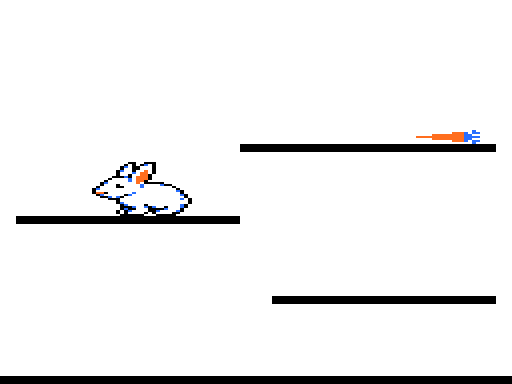

# bunny-jump

A platformer proof of concept for the Tandy Color Computer 1/2: hop a white
LPC-style bunny up the ledges to a carrot, eat it, and earn a heart. RG6
graphics (128x192 artifact pixels in black, white, red and blue), running at
60 frames per second with page flipping.



Written in Forth with 6809 assembly, using the kernel and cross-compiler from
the coco project. It grew out of the bunny demo
(https://github.com/ugufru/bunny).

## Playing

The level is four platforms: the floor, two ledges and a top ledge with the
carrot. Hop from ledge to ledge; platforms are one-way, so you can hop up
through them from below and land on them from above. Walking off an edge
drops you to whatever is below.

Reach the carrot and the bunny eats it bite by bite, stepping forward as it
shrinks, and earns a heart. Press space to play the level again and collect
another heart (up to 10 are shown). The bunny starts with none.

## Controls

- Left / right arrow: turn around, or take a small step if already facing
  that way (one step per press)
- Space: hop (straight up, or up-left / up-right with an arrow held)
- BREAK (Esc in XRoar): quit to BASIC

## Requirements

- A checkout of the coco project (https://github.com/ugufru/coco) at
  `~/github/coco` (or set `COCO=...`). Tested with coco commit `b5158e6`.
- `lwasm` (to build the kernel if it isn't built yet)
- Python 3 with Pillow (sprite converter and screenshots)
- XRoar with `bas12.rom` and `extbas11.rom` in `~/.xroar/roms/`

## Build and run

```sh
make                  # builds bunny-jump.bin
make run              # launches XRoar (32K CoCo 2, NTSC artifact colors)
make preview          # opens build/preview.png, every sprite frame
make shot SHOT_PROG=autoplay SHOT_AT=140
                      # headless: runs a program to its 140th vsync and
                      # renders the page on screen to build/shot.png
make cycles           # fc.py cycle estimates per word
make issues           # rebuilds issues.html from issues.jsonl and roadmap.jsonl
make clean
```

Any top-level `.fs` program builds with `make name.bin` and runs with
`make run-name`, for example `make run-keytest`.

## How it fits together

- `bunny-jump.fs`: the game entry point; the game itself is in `game.fs`.
- `game.fs`: level table, hop physics tuning, stepping, drawing with
  per-page erase and repair, the carrot eat sequence, hearts and the main
  loop. The sprite draw path (`move-sprite`) is 6809 assembly.
- `fast.fs`: per-frame work in assembly: airborne physics and landing,
  frame choice, repair tests, and page flipping (a second RG6 page at
  `$6000`, shown at vsync) with physics stepped once per 60 Hz field.
- `input.fs`: keyboard matrix scan in assembly, with held and pressed
  states for the arrows, space and BREAK.
- `blit.fs`: opaque byte-aligned blit and box fill for the white background.
- `autoplay.fs`: the same game driven by a key script, for headless checks
  with `make shot`.
- `blittest.fs`, `spritetest.fs`, `keytest.fs`: small test programs.
- `tools/png2rg6.py` reads `tools/frames.json` and writes `build/sprites.fs`:
  opaque 2bpp RG6 sprite records, mirrored and recolored frames, anchor
  offsets, and `build/preview.png`.
- `tools/rg6shot.py`: renders an RG6 page from an XRoar RAM dump (used by
  `make shot`).
- `mk/*.mk`: Makefile fragments for sprites and screenshots.
- `assets/bunnysheet5.png`: the original sprite sheet; `assets/extra/*.txt`:
  hand-drawn ASCII pixel frames (carrot stages, heart).
- `issues.jsonl`, `roadmap.jsonl`, `issues.html`: work tracking; open
  `issues.html` to browse.
- `CREDITS.md`: art attribution and licenses.
- `RETROSPECTIVE.md`: how this repo got built, from the session that
  built it.

## How it got built

The whole thing was built in one session, from a concept to this repo.

It started from the bunny demo, which runs in a 128x96 four-color mode. This
game needed the other one: 256x192 dots that NTSC artifacting turns into 128
wide pixels in black, white, red and blue. The first program drawn was four
color bands, to settle which bit pattern shows red before any art depended on
the answer. Then the plan became a tracker of issues and a ranked roadmap, and
the work followed it: a sprite pipeline, a keyboard scan, hop physics,
one-way platforms, the carrot and the hearts.

Two things shaped the result more than the plan did. The first was a white
background with a black-outlined bunny, decided after the first sprites were
converted. The kernel's sprite routine treats black as transparent, so it
could not draw an outline, and the game got its own byte-copying blitter
instead: faster, and the reason the bunny moves sideways in four pixel steps.
The second was a question about frame rate. It was running at about 22 frames
per second while hopping, not 60. Getting there took measuring where the
video fields actually went, moving the drawing, physics and keyboard into
6809 assembly, halving the art height to 1x1 rows (which turned out to look
better anyway), and finally drawing every frame on a hidden second screen
page and switching pages during vertical blank, which also removed the
flicker.

Along the way the bunny fell through every platform for a while, because a
kernel word read its argument from the wrong place on the stack, and kept
falling until it wrote over the program. That one is filed to fix upstream.

The full account, including what went wrong and what would be done
differently, is in [RETROSPECTIVE.md](RETROSPECTIVE.md).

## Status

A proof of concept of the core mechanic: hopping, stepping, one-way ledges,
the carrot eat sequence and earned hearts, at 60 fps without flicker.

Open work includes art touch-ups for the 1x1 bunny, a LEVEL COMPLETE banner,
more levels, and smoother sideways motion. What happens when the bunny fails
is still undecided: the ideas under consideration are bonks and naps (a fall
or hazard costs a heart, and at zero hearts the bunny falls asleep and wakes
at the start), predators that chase the bunny home, hunger, or no fail state
at all.

The work is tracked in `issues.jsonl` and ranked in `roadmap.jsonl`; open
`issues.html` in a browser to read it.

## License

The code (Forth, assembly, Python tools, Makefile) is under the BSD 2-Clause
license in `LICENSE`, the same license as the coco project.

The art is not: the bunny sprite sheet and the frames derived from it
(`assets/`, `screenshot.png`, and the sprite data generated from them) are
under CC-BY-SA 3.0. See `CREDITS.md`.

## Credits

Bunny art: "Bunny Rabbit LPC Style for PixelFarm" by Stephen 'Redshrike'
Challener, commissioned for PixelFarm, CC-BY 3.0 / CC-BY-SA 3.0 / OGA-BY 3.0.
See `CREDITS.md`.
